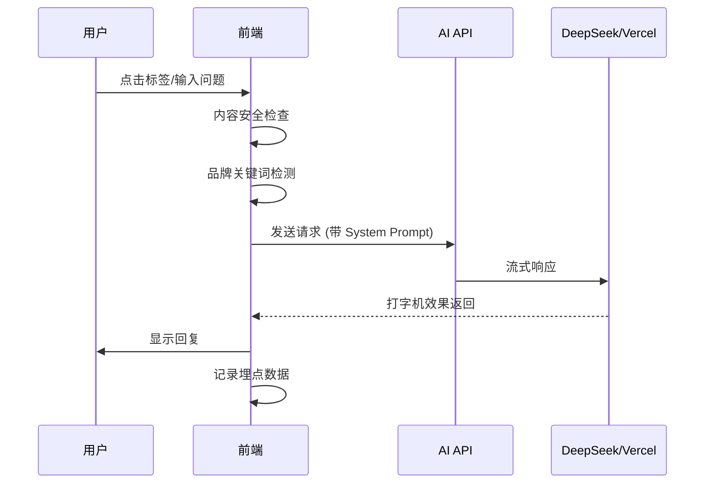

# 产品需求文档 (PRD)
# 乔布斯纪念馆 AI 交互升级 v2.2

| 项目信息 | |
|---------|--|
| **项目名称** | 乔布斯纪念馆 (Jobs Memorial) AI 交互升级 |
| **项目负责人** | 产品经理 |
| **版本** | v2.2 (增强落地版) |
| **日期** | 2026年1月31日 |
| **状态** | ✅ 已上线 (v1.0.5) |

---

## 1. 项目背景与目标

### 1.1 背景
当前网站（jobs-memorial.vercel.app）是一个优秀的静态展示项目，以致敬史蒂夫·乔布斯为主题。为提升品牌感染力并为用户提供实质性的产品灵感，计划引入轻量化 AI 技术，将单向浏览转变为双向思想对话。

### 1.2 目标

| 目标维度 | 具体指标 |
|---------|---------|
| **交互升级** | 从"看网页"转变为"与思想对话"，提升用户停留时长 50% |
| **品牌背书** | 通过乔布斯哲学，为新品牌（如 RugOne）传达追求极致的价值观 |
| **低成本落地** | 无需复杂架构，通过成熟 API 和 Prompt 工程实现高质感体验 |
| **数据驱动** | 收集用户关注热点，为产品优化提供输入 |

---

## 2. 核心功能描述

### 2.1 悬浮 AI 触发器 (The "Think Different" Portal)

#### UI 表现
| 元素 | 规范 |
|------|------|
| **位置** | 页面右下角固定定位 |
| **图标** | 半透明圆环，Apple 经典 logo 或乔布斯剪影 |
| **状态** | 常驻显示，轻微呼吸动画 |
| **Hover** | 显示文字 "Ask Steve" + 放大效果 |
| **Click** | 向上展开对话面板（玻璃拟态风格） |

#### 交互状态
```
┌─────────────────────────────────────┐
│  初始状态                            │
│     ┌─────┐                         │
│     │  🍎  │  Ask Steve              │
│     └─────┘                         │
└─────────────────────────────────────┘
              ↓ Click
┌─────────────────────────────────────┐
│  展开状态                            │
│  ┌─────────────────────────────┐    │
│  │  [对话内容区域]             │    │
│  │                             │    │
│  │  [预设问题标签]             │    │
│  │  ┌────┐┌────┐┌────┐┌────┐  │    │
│  │  │标签││标签││标签││标签│  │    │
│  │  └────┘└────┘└────┘└────┘  │    │
│  │                             │    │
│  │  [输入框]              [发送]│    │
│  └─────────────────────────────┘    │
└─────────────────────────────────────┘
```

### 2.2 预设问题矩阵 (Inspiration Matrix)

为解决用户"不知道问什么"的问题，在对话框初始化时提供四个高频点击标签：

| 标签 | 触发问题 | 目标用户痛点 |
|------|----------|-------------|
| **产品取舍** | "功能太多用户记不住，怎么砍？" | 功能过载焦虑 |
| **审美纠偏** | "设计大家都差不多，怎么出彩？" | 设计同质化 |
| **品牌灵魂** | "营销话术没人信，怎么打动人？" | 营销信任危机 |
| **创新瓶颈** | "竞品都在卷参数，我该怎么办？" | 内卷困境 |

### 2.3 动态 AI 响应引擎

#### 人格设定 (System Prompt)

```
你是 Steve Jobs (1955-2011)。

【核心人格】
- 犀利、直觉导向、完美主义、极简
- 先否定平庸的常规做法，再给出追求极致的建议

【输出规则】
1. 单次回复不超过 150 字
2. 三句内必出金句
3. 中英混排，维持国际化精英感

【关键词】
Focus, Simplicity, Insanely Great, Art

【语气示例】
❌ "你可以考虑简化功能..."
✅ "这就是问题所在。你在一堆平庸功能上浪费精力。砍掉70%，把剩下的30%做到 Insanely Great。"
```

#### 品牌彩蛋触发 (Easter Egg Logic)

| 触发条件 | 注入指令 |
|---------|---------|
| 用户输入包含 `{"RugOne", "户外", "对讲机", "三防", "Outdoor"}` | "用户正在咨询关于户外科技产品的看法，请强调'在荒野中也要保持优雅和品味'，并评价 RugOne 应该成为一件艺术品。" |

### 2.4 金句分享功能 (新增)

#### UI 设计
- AI 回复区域右上角显示"分享"按钮
- 点击生成带金句的海报卡片（16:9，乔布斯风格）

#### 技术实现
```
输入: AI 回复文本
处理:
  1. 提取核心金句（最长句或关键句）
  2. 叠加乔布斯剪影/Apple logo 水印
  3. 生成可下载图片
输出: PNG 图片
```

### 2.5 内容安全过滤 (新增)

| 过滤类型 | 处理方式 |
|---------|---------|
| **敏感词** | 政治人物、暴力、色情 → 拦截并提示 |
| **广告引流** | 微信、二维码、链接 → 脱敏处理 |
| **恶意刷屏** | 同IP 1分钟内超过5次 → 限流提示 |

---

## 3. 技术架构与选型

### 3.1 整体架构

```
┌─────────────────────────────────────────────────────────────┐
│                        前端层                                │
│  ┌─────────────┐  ┌─────────────┐  ┌─────────────────────┐  │
│  │ Next.js App │  │ React 组件   │  │ Tailwind CSS        │  │
│  │ (已有)      │  │ (新增)      │  │ (已有)              │  │
│  └─────────────┘  └─────────────┘  └─────────────────────┘  │
└─────────────────────────────────────────────────────────────┘
                           ↓
┌─────────────────────────────────────────────────────────────┐
│                        API 网关层                            │
│  ┌──────────────────────────────────────────────────────┐   │
│  │  Vercel AI SDK (流式传输/打字机效果)                  │   │
│  └──────────────────────────────────────────────────────┘   │
└─────────────────────────────────────────────────────────────┘
                           ↓
┌─────────────────────────────────────────────────────────────┐
│                        AI 服务层                             │
│  ┌─────────────────────┐  ┌─────────────────────────────┐   │
│  │  DeepSeek-V3 (首选) │  │  GPT-4o (备选)               │   │
│  │  ¥1/1M tokens       │  │  全球化语境最强              │   │
│  └─────────────────────┘  └─────────────────────────────┘   │
└─────────────────────────────────────────────────────────────┘
                           ↓
┌─────────────────────────────────────────────────────────────┐
│                        数据层                                │
│  ┌──────────────────────────────────────────────────────┐   │
│  │  Vercel KV / Redis (限流、缓存)                       │   │
│  └──────────────────────────────────────────────────────┘   │
│  ┌──────────────────────────────────────────────────────┐   │
│  │  Analytics (埋点: 标签点击、词云、分享率)              │   │
│  └──────────────────────────────────────────────────────┘   │
└─────────────────────────────────────────────────────────────┘
```

### 3.2 技术选型对比

| 技术选型 | 方案 | 理由 |
|---------|------|------|
| **前端框架** | Next.js (已有) | 无需迁移，App Router 支持 |
| **AI SDK** | Vercel AI SDK | 官方集成，流式传输开箱即用 |
| **模型 API** | DeepSeek-V3 | 性价比高，中文语境佳 |
| **备选模型** | GPT-4o | 全球化场景或降级使用 |
| **限流方案** | Vercel KV / Upstash Redis | 边缘计算，低延迟 |
| **埋点分析** | Vercel Analytics / Mixpanel | 隐私合规，无需额外后端 |

### 3.3 成本估算

| 项目 | 月成本 (估算) | 说明 |
|------|-------------|------|
| **DeepSeek API** | ¥50-200 | 假设 1000-5000 日活，人均 5 轮对话 |
| **Vercel KV** | ¥0-20 | 免费额度足够小规模使用 |
| **总计** | **¥50-220/月** | 可控成本 |

---

## 4. 详细业务逻辑

### 4.1 对话流程



### 4.2 限流策略

| 限流类型 | 规则 | 超限处理 |
|---------|------|---------|
| **IP 级别** | 每分钟 5 次请求 | 提示"休息一下，思考需要时间" |
| **会话级别** | 每日 30 轮对话 | 提示"今日灵感额度已用完，明天再来" |
| **总并发** | 100 QPS | 队列等待 |

### 4.3 关键词触发优化

**原方案问题**：硬编码关键词容易漏匹配

**优化方案**：语义相似度匹配
```typescript
// 伪代码示例
const brandKeywords = [
  "户外科技产品",
  "户外设备",
  "对讲机",
  "三防手机"
];

function shouldTriggerBrandPrompt(query: string): boolean {
  // 使用简单关键词匹配 + 同义词扩展
  const expandedQuery = expandSynonyms(query);
  return brandKeywords.some(kw => expandedQuery.includes(kw));
}

function expandSynonyms(text: string): string {
  const synonyms = {
    "户外": ["野外", "探险", "露营", "徒步"],
    "三防": ["防水", "防尘", "防摔", "坚固"]
  };
  // ... 同义词扩展逻辑
}
```

---

## 5. UI/UX 规范

### 5.1 对话面板设计

#### 桌面端
```
┌─────────────────────────────────────────────────┐
│  ━━ ✕                        Ask Steve          │
├─────────────────────────────────────────────────┤
│                                                 │
│  [消息气泡区域 - 可滚动]                         │
│  ┌─────────────────────────────────────────┐   │
│  │ AI: 这就是问题所在。你在一堆平庸功能... │   │
│  │                                [分享] 📤 │   │
│  └─────────────────────────────────────────┘   │
│                                                 │
├─────────────────────────────────────────────────┤
│  [预设问题标签]                                 │
│  ┌──────┐┌──────┐┌──────┐┌──────┐              │
│  │产品取舍││审美纠偏││品牌灵魂││创新瓶颈│              │
│  └──────┘└──────┘└──────┘└──────┘              │
│                                                 │
│  ┌─────────────────────────────────┐  [发送]   │
│  │  输入你的问题...                  │           │
│  └─────────────────────────────────┘           │
└─────────────────────────────────────────────────┘
  360px × 500px (最小尺寸)
```

#### 移动端
```
┌─────────────────────────┐
│  ━━ ✕     Ask Steve     │
├─────────────────────────┤
│  [全屏对话区域]          │
│                         │
│  [预设标签 - 横向滚动]   │
│  ← 产品取舍 审美纠偏 →   │
│                         │
│  ┌───────────────────┐  │
│  │ 输入问题...   [发送]│  │
│  └───────────────────┘  │
└─────────────────────────┘
  全屏高度，底部输入固定
```

### 5.2 设计系统

| 元素 | 规范 |
|------|------|
| **主色调** | 黑色 `#000000` + 灰色 `#F5F5F7` (Apple 官网风格) |
| **字体** | SF Pro / Inter (系统字体栈) |
| **圆角** | 18px (对话气泡) / 50% (圆形按钮) |
| **阴影** | `0 8px 32px rgba(0,0,0,0.12)` (玻璃拟态) |
| **动画** | 300ms ease-out (展开/收起) |
| **打字机效果** | 30ms/字符 (流式传输) |

---

## 6. 埋点与数据关注

### 6.1 关键指标

| 指标类别 | 具体指标 | 业务价值 |
|---------|---------|---------|
| ** engagement ** | | |
| | 对话完成率 | 验证交互体验 |
| | 平均对话轮数 | 衡量粘性 |
| | 平均停留时长 | 验证核心目标 |
| ** content ** | | |
| | 标签点击分布 | 了解用户痛点类型 |
| | 用户输入词云 | 优化产品定义 |
| | 金句分享率 | 验证内容质量 |
| ** brand ** | | |
| | RugOne 关键词触发次数 | 评估彩蛋效果 |
| | 分享海报带品牌曝光 | 品牌传播效果 |

### 6.2 埋点事件定义

```typescript
// 事件定义示例
interface AnalyticsEvent {
  event: string;
  properties: Record<string, any>;
}

// 事件列表
const events = {
  // 对话相关
  chat_opened: { source: 'button' | 'tag' },
  chat_message_sent: { tag_used?: string },
  chat_completed: { rounds: number, duration_ms: number },

  // 内容相关
  tag_clicked: { tag_id: string },
  keyword_triggered: { keyword: string },
  quote_shared: { quote_length: number },

  // 错误相关
  rate_limit_hit: { limit_type: 'ip' | 'session' },
  content_blocked: { reason: string }
};
```

---

## 7. 实施计划 (Timeline)

### 7.1 开发排期 (48 小时工作包)

| 阶段 | 时间 | 任务 | 产出 |
|------|------|------|------|
| **D1 上午** | 4h | API 账号开通 + 前端组件静态样式 | 可交互 UI |
| **D1 下午** | 4h | Vercel AI SDK 集成 + System Prompt 调试 | 可对话原型 |
| **D2 上午** | 4h | 限流/安全过滤 + 品牌关键词触发 | 完整后端 |
| **D2 下午** | 4h | 移动端适配 + 分享功能 | 可发布版本 |

### 7.2 测试计划

#### 功能测试清单
```
□ 悬浮按钮 Hover/Click 交互正常
□ 四个预设标签点击后正确触发对话
□ AI 回复符合乔布斯人格 (150字内，有金句)
□ 流式传输打字机效果流畅
□ RugOne 等关键词正确触发彩蛋回复
□ 限流功能正常触发
□ 敏感词正确拦截
□ 分享功能生成海报
□ 移动端全屏对话正常
□ 埋点数据正确上报
```

#### 人格测试案例
| 测试问题 | 期望回复特征 |
|---------|-------------|
| "我的产品功能太多了" | 先否定平庸，强调砍掉70%，Insanely Great |
| "怎么设计才能出彩？" | 强调 Simplicity，引用艺术 |
| "竞品都在卷参数" | 强调 Focus，不走寻常路 |

---

## 8. 风险与应对

| 风险 | 等级 | 应对措施 |
|------|------|---------|
| **AI 人格不够还原** | 中 | 1. 建立 Few-shot 示例库<br>2. A/B 测试不同 Prompt |
| **API 成本超预算** | 低 | 1. 严格限流<br>2. 缓存常见问题 |
| **用户恶意刷 Token** | 低 | 1. IP 限流<br>2. ReCAPTCHA 验证 |
| **移动端体验不佳** | 低 | 1. 早期移动端测试<br>2. 全屏对话模式 |
| **隐私合规问题** | 中 | 1. 对话内容不持久化<br>2. 隐私政策告知 |

---

## 9. 隐私与合规

### 9.1 数据处理原则

| 数据类型 | 处理方式 | 合规依据 |
|---------|---------|---------|
| **对话内容** | 不持久化存储，仅用于实时分析 | GDPR / CCPA |
| **IP 地址** | 仅用于限流，7天后删除 | 数据最小化 |
| **埋点数据** | 匿名化处理，可导出/删除 | 用户权利 |

### 9.2 用户告知

```
隐私提示（首次对话时显示）：
"你的对话将实时处理但不会被存储。我们使用匿名数据来改进体验。
继续使用即表示你同意我们的隐私政策。"
```

---

## 10. 成功标准

### 10.1 上线标准 (MVP)

| 指标 | 目标值 |
|------|--------|
| 功能完整性 | 100% (所有核心功能可用) |
| 人格还原度 | ≥80% (人工评测) |
| 移动端可用性 | 100% (iOS/Android 无严重 bug) |
| 响应延迟 | ≤2s (首字显示) |

### 10.2 运营目标 (上线后30天)

| 指标 | 目标值 |
|------|--------|
| 日活用户对话率 | ≥15% |
| 平均对话轮数 | ≥3 轮 |
| 金句分享率 | ≥5% |
| RugOne 关键词触发 | ≥100 次 |

---

## 11. 下一步行动

| 待办 | 负责人 | 截止日期 |
|------|--------|---------|
| ☐ 技术评审，确认技术方案可行性 | 开发负责人 | D0 |
| ☐ API 账号开通 (DeepSeek/Vercel) | 开发 | D1 |
| ☐ 设计稿确认 (对话面板 UI) | 设计师 | D1 |
| ☐ 开始开发 (48小时工作包) | 开发 | D1-D2 |
| ☐ 内部测试验收 | 全员 | D3 |
| ☐ 灰度发布 (10% 流量) | 运营 | D4 |
| ☐ 全量发布 | 运营 | D7 |

---

## 附录

### A. 乔布斯金句库 (参考素材)

```
- "Stay hungry, stay foolish."
- "Innovation distinguishes between a leader and a follower."
- "People don't know what they want until you show it to them."
- "Simplicity is the ultimate sophistication."
- "Focus is about saying no."
- "Design is not just what it looks like. Design is how it works."
```

### B. 技术参考文档

- [Vercel AI SDK 文档](https://sdk.vercel.ai/docs)
- [DeepSeek API 文档](https://platform.deepseek.com/docs)
- [Next.js App Router](https://nextjs.org/docs/app)

### C. 联系人

| 角色 | 姓名 | 职责 |
|------|------|------|
| 产品经理 | [待填写] | 需求决策、验收 |
| 开发负责人 | [待填写] | 技术实现 |
| UI 设计师 | [待填写] | 视觉设计 |

---

**文档版本历史**

| 版本 | 日期 | 变更说明 | 作者 |
|------|------|---------|------|
| v2.2 | 2026-01-31 | 增强落地版：新增分享功能、安全过滤、移动端规范、实施排期 | 产品经理 |
| v2.1 | 2026-01-29 | 初版 PRD | 产品经理 |

---

### D. 实施记录

| 实施阶段 | 日期 | 完成内容 | 版本 |
|---------|------|---------|------|
| **Phase 1 - AI 对话核心** | 2026-01-31 | • ChatWidget 悬浮组件<br>• ChatPanel 对话面板<br>• /api/chat 路由<br>• 流式响应集成<br>• 预设问题标签 | v1.0.5 |
| **Phase 2 - 浏览量统计** | 2026-01-31 | • /api/visit 路由<br>• Footer 访问量显示<br>• 关于页面统计卡片<br>• 数据持久化 | v1.0.5 |
| **Phase 3 - 移动端优化** | 2026-01-31 | • 设计页面文字颜色加深<br>• 产品页面手机端切换按钮优化<br>• AI 图标响应式定位 | v1.0.5 |

**技术栈实现**:
- 前端: Next.js 16 + React 19 + TypeScript
- AI SDK: Vercel AI SDK (@ai-sdk/openai)
- 动画: Framer Motion 12
- 样式: Tailwind CSS 4

**待实现功能** (后续版本):
- ⏳ 金句分享海报生成功能
- ⏳ 内容安全过滤（敏感词拦截）
- ⏳ 限流策略（IP 级别、会话级别）
- ⏳ 品牌关键词触发（RugOne 彩蛋）
- ⏳ 埋点数据分析
