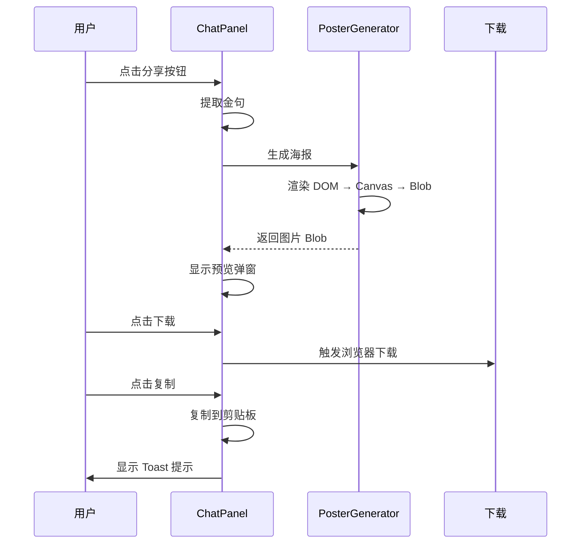

# 产品需求文档 (PRD)
# 乔布斯纪念馆 AI 交互升级 v2.3

| 项目信息 | |
|---------|--|
| **项目名称** | 乔布斯纪念馆 (Jobs Memorial) AI 交互升级 |
| **项目负责人** | 产品经理 |
| **版本** | v2.3 (全量优化版) |
| **日期** | 2026年2月5日 |
| **状态** | 🚧 开发中 (从 v1.1.0 升级) |

---

## 1. 项目背景与目标

### 1.1 背景
当前网站（jobs-memorial.vercel.app）已完成 v1.1.0 版本，实现了 AI 对话核心功能、浏览量统计、内容安全过滤和限流策略。为提升用户体验和数据驱动能力，计划进行全量优化升级。

### 1.2 目标

| 目标维度 | 具体指标 |
|---------|---------|
| **分享体验升级** | 金句海报生成，提升社交传播率 30% |
| **交互质感提升** | Toast 提示组件，替代原生 alert |
| **移动端完善** | 全屏对话模式，移动端可用性 100% |
| **数据驱动** | 完整埋点系统，优化产品决策 |
| **系统稳定性** | 多 AI 模型备选，提升可用性至 99.9% |

---

## 2. 新增功能描述 (v2.3)

### 2.1 金句海报生成功能 ⭐ P0

#### 功能概述
将 AI 回复中的金句生成为乔布斯风格的可分享海报图片。

#### UI 设计

**桌面端**
```
┌─────────────────────────────────────────────────┐
│  AI 消息气泡                                      │
│  ┌─────────────────────────────────────────┐   │
│  │ 这就是问题所在。你在一堆平庸功能上浪费... │   │
│  │                                [📤分享] │   │
│  └─────────────────────────────────────────┘   │
└─────────────────────────────────────────────────┘
                    ↓ 点击分享
┌─────────────────────────────────────────────────┐
│  ┌─────────────────────────────────────────┐   │
│  │              [海报预览]                   │   │
│  │  ┌─────────────────────────────────┐    │   │
│  │  │                                 │    │   │
│  │  │   "这就是问题所在。你在一堆        │    │   │
│  │  │    平庸功能上浪费精力。           │    │   │
│  │  │    砍掉70%，做到 Insanely Great." │    │   │
│  │  │                                 │    │   │
│  │  │            — Steve Jobs          │    │   │
│  │  │                                 │    │   │
│  │  │    [乔布斯剪影 / Apple Logo]     │    │   │
│  │  │                                 │    │   │
│  │  └─────────────────────────────────┘    │   │
│  │                                          │   │
│  │  [下载图片]  [复制到剪贴板]  [取消]      │   │
│  └─────────────────────────────────────────┘   │
└─────────────────────────────────────────────────┘
```

**海报样式规范**
| 元素 | 规范 |
|------|------|
| **尺寸** | 1080×1080 (1:1) 或 1080×1920 (9:16) |
| **背景** | 纯黑 `#000000` 或深灰渐变 |
| **字体** | SF Pro Display / Inter |
| **文字颜色** | 白色 `#FFFFFF` |
| **水印** | 半透明乔布斯剪影或 Apple logo (10% 透明度) |
| **边框** | 1px 白色细线边框 |
| **署名** | 右下角 "— Steve Jobs" |
| **品牌标识** | 底部小字 "jobs-memorial.vercel.app" |

#### 技术实现

**方案选择：html2canvas**
```typescript
// lib/quote-poster.ts
export interface PosterOptions {
  text: string;
  author?: string;
  size?: 'square' | 'portrait';
  theme?: 'dark' | 'light';
}

export async function generateQuotePoster(
  options: PosterOptions
): Promise<Blob> {
  // 1. 创建隐藏的 DOM 元素
  const container = createPosterElement(options);

  // 2. 使用 html2canvas 渲染
  const canvas = await html2canvas(container, {
    scale: 2, // 2x 分辨率
    backgroundColor: '#000000',
    logging: false,
  });

  // 3. 转换为 Blob
  return new Promise((resolve) => {
    canvas.toBlob((blob) => {
      resolve(blob!);
    }, 'image/png');
  });
}
```

**依赖安装**
```bash
npm install html2canvas
npm install --save-dev @types/html2canvas
```

#### 金句提取算法优化

```typescript
// 增强版金句提取
export function extractQuote(message: string): QuoteResult | null {
  if (!message || message.length < 20) return null;

  // 策略1: 包含关键词的句子
  const powerWords = [
    'Simplicity', 'Focus', 'Great', 'Art', 'Taste',
    '简单', '极致', '专注', '不', '艺术', '品味'
  ];

  // 策略2: 英文引语
  const englishQuotes = message.match(/"[A-Z][^"]{20,}"/g);

  // 策略3: 最长且最有力量的句子
  const sentences = message.split(/[。！？.!?]/)
    .filter(s => s.trim().length > 15);

  // 评分系统
  let bestSentence = '';
  let maxScore = 0;

  for (const sentence of sentences) {
    let score = sentence.length * 0.3; // 长度权重

    // 关键词加分
    for (const word of powerWords) {
      if (sentence.includes(word)) score += 20;
    }

    // 英文加分
    if (/[a-zA-Z]{10,}/.test(sentence)) score += 15;

    // 简短有力加分
    if (sentence.length < 50) score += 10;

    if (score > maxScore) {
      maxScore = score;
      bestSentence = sentence;
    }
  }

  return {
    text: bestSentence.trim() || message.slice(0, 100),
    startIndex: message.indexOf(bestSentence),
    endIndex: message.indexOf(bestSentence) + bestSentence.length,
  };
}
```

#### 交互流程



---

### 2.2 Toast 提示组件 ⭐ P0

#### 功能概述
替代原生 `alert()`，提供优雅的提示反馈组件。

#### 设计规范

**Toast 类型**
| 类型 | 图标 | 颜色 | 使用场景 |
|------|------|------|----------|
| success | ✅ | 绿色渐变 | 分享成功、复制成功 |
| error | ❌ | 红色渐变 | 操作失败、错误提示 |
| info | ℹ️ | 蓝色渐变 | 一般信息提示 |
| warning | ⚠️ | 黄色渐变 | 警告提示 |

**UI 设计**
```typescript
// components/Toast.tsx
interface ToastProps {
  type: 'success' | 'error' | 'info' | 'warning';
  message: string;
  duration?: number; // 默认 3000ms
  onClose?: () => void;
}
```

**样式规范**
| 元素 | 规范 |
|------|------|
| **位置** | 屏幕顶部中央 (top: 20px) |
| **宽度** | 最大 400px，自适应内容 |
| **圆角** | 12px |
| **阴影** | `0 8px 32px rgba(0,0,0,0.2)` |
| **动画** | 滑入/淡出 300ms ease-out |
| **图标** | 20px × 20px |
| **字体** | 14px, 中等字重 |

#### 使用示例

```typescript
// lib/toast.ts
export const toast = {
  success: (message: string) => showToast({ type: 'success', message }),
  error: (message: string) => showToast({ type: 'error', message }),
  info: (message: string) => showToast({ type: 'info', message }),
  warning: (message: string) => showToast({ type: 'warning', message }),
};

// 使用示例
toast.success('金句已复制到剪贴板！');
toast.error('生成海报失败，请重试');
```

#### 技术实现

```typescript
// components/ToastProvider.tsx
'use client';

import { createContext, useContext, useState, useCallback } from 'react';
import { AnimatePresence } from 'framer-motion';
import Toast from './Toast';

interface ToastItem {
  id: string;
  type: 'success' | 'error' | 'info' | 'warning';
  message: string;
}

const ToastContext = createContext<{
  toast: (type: ToastItem['type'], message: string) => void;
}>({
  toast: () => {},
});

export function ToastProvider({ children }: { children: React.ReactNode }) {
  const [toasts, setToasts] = useState<ToastItem[]>([]);

  const toast = useCallback((type: ToastItem['type'], message: string) => {
    const id = Math.random().toString(36).slice(2);
    setToasts(prev => [...prev, { id, type, message }]);

    // 自动移除
    setTimeout(() => {
      setToasts(prev => prev.filter(t => t.id !== id));
    }, 3000);
  }, []);

  return (
    <ToastContext.Provider value={{ toast }}>
      {children}

      {/* Toast 容器 */}
      <div className="fixed top-4 left-1/2 -translate-x-1/2 z-[100] space-y-2">
        <AnimatePresence>
          {toasts.map(toast => (
            <Toast key={toast.id} {...toast} />
          ))}
        </AnimatePresence>
      </div>
    </ToastContext.Provider>
  );
}

export const useToast = () => useContext(ToastContext);
```

---

### 2.3 移动端全屏对话 ⭐ P0

#### 功能概述
在小屏设备（宽度 < 768px）上，对话面板自动切换为全屏模式。

#### 设计规范

**移动端全屏布局**
```
┌─────────────────────────────────┐
│  ━━━━━ ✕     Ask Steve         │ ← 固定头部
├─────────────────────────────────┤
│                                 │
│  [消息气泡区域 - 可滚动]         │
│  ┌───────────────────────────┐  │
│  │ AI: 这就是问题所在...      │  │
│  │                    [📤分享] │  │
│  └───────────────────────────┘  │
│                                 │
│  [预设问题标签 - 横向滚动]       │
│  ← 产品取舍 审美纠偏 →           │
├─────────────────────────────────┤
│  ┌─────────────────────────┐    │
│  │ 输入问题...         [发送]│   │ ← 固定底部
│  └─────────────────────────┘    │
└─────────────────────────────────┘
  全屏高度 (100vh)
```

#### 响应式断点

| 断点 | 宽度 | 对话框行为 |
|------|------|-----------|
| **移动端** | < 768px | 全屏居中弹窗 |
| **平板** | 768px - 1024px | 右侧固定面板，宽度 400px |
| **桌面端** | > 1024px | 右侧固定面板，宽度 420px |

#### 技术实现

```typescript
// components/ChatPanel.tsx (增强版)
export default function ChatPanel({ /* ... */ }) {
  const [isMobile] = useMediaQuery('(max-width: 768px)');

  return (
    <motion.div
      className={cn(
        "bg-black/95 backdrop-blur-xl border border-white/20 shadow-2xl",
        "overflow-hidden flex flex-col z-50",
        isMobile ? "fixed inset-0 rounded-none" : "fixed top-1/2 right-24 -translate-y-1/2 rounded-3xl max-w-[400px] max-h-[80vh]"
      )}
    >
      {/* 移动端：全屏头部 */}
      <div className={cn(
        "flex items-center justify-between border-b border-white/10",
        isMobile ? "px-4 py-4" : "px-4 py-3"
      )}>
        <div className="flex items-center gap-2">
          {/* ... */}
        </div>
      </div>

      {/* 消息区域 - 移动端占据剩余空间 */}
      <div className={cn(
        "overflow-y-auto",
        isMobile ? "flex-1" : "max-h-[300px]"
      )}>
        {/* ... */}
      </div>

      {/* 输入区域 - 移动端固定底部 */}
      <div className={cn(
        "border-t border-white/10",
        isMobile ? "p-4 safe-area-bottom" : "p-3"
      )}>
        {/* ... */}
      </div>
    </motion.div>
  );
}
```

**iOS 安全区域适配**
```css
/* 支持刘海屏和底部指示器 */
@supports (padding: max(0px)) {
  .safe-area-bottom {
    padding-bottom: max(1rem, env(safe-area-inset-bottom));
  }
}
```

---

### 2.4 埋点数据分析系统 ⭐ P1

#### 功能概述
建立完整的数据收集和分析系统，支持产品优化决策。

#### 埋点事件定义

```typescript
// lib/analytics.ts
export interface AnalyticsEvent {
  event: string;
  properties: Record<string, any>;
  timestamp: number;
  userId?: string;
  sessionId: string;
}

// 事件列表
export const ANALYTICS_EVENTS = {
  // 对话相关
  'chat.opened': {
    source: 'button' | 'tag' | 'direct',
    page: string,
  },
  'chat.message_sent': {
    preset_id?: string,
    message_length: number,
    has_brand_keyword: boolean,
  },
  'chat.completed': {
    rounds: number,
    duration_ms: number,
    messages_count: number,
  },

  // 内容相关
  'tag.clicked': {
    tag_id: string,
    tag_label: string,
  },
  'keyword.triggered': {
    keyword: string,
    category: 'brand' | 'general',
  },
  'quote.shared': {
    method: 'copy' | 'download',
    quote_length: number,
  },

  // 错误相关
  'rate_limit.hit': {
    limit_type: 'ip' | 'session',
    remaining: number,
  },
  'content.blocked': {
    reason: string,
    category: 'sensitive' | 'ad',
  },
  'ai.error': {
    provider: 'zhipu' | 'deepseek' | 'openai',
    error_type: string,
  },
};
```

#### 数据收集架构

```
┌─────────────────────────────────────────────────────────────┐
│                        前端埋点层                            │
│  ┌─────────────┐  ┌─────────────┐  ┌─────────────────────┐  │
│  │ 页面访问    │  │ 交互点击    │  │ 错误捕获            │  │
│  └─────────────┘  └─────────────┘  └─────────────────────┘  │
└─────────────────────────────────────────────────────────────┘
                           ↓
┌─────────────────────────────────────────────────────────────┐
│                        API 网关层                            │
│  ┌──────────────────────────────────────────────────────┐   │
│  │  /api/analytics/event - 接收埋点数据                  │   │
│  └──────────────────────────────────────────────────────┘   │
└─────────────────────────────────────────────────────────────┘
                           ↓
┌─────────────────────────────────────────────────────────────┐
│                        存储层                                │
│  ┌──────────────────────────┐  ┌──────────────────────────┐ │
│  │  Vercel KV (实时数据)     │  │  JSON 文件 (历史数据)    │ │
│  │  - 今日统计               │  │  - 详细事件日志          │ │
│  │  - 热门标签               │  │  - 可导出分析            │ │
│  └──────────────────────────┘  └──────────────────────────┘ │
└─────────────────────────────────────────────────────────────┘
```

#### API 端点设计

**POST /api/analytics/event**
```typescript
// 记录单个事件
interface EventRequest {
  event: string;
  properties: Record<string, any>;
}

// 响应
interface EventResponse {
  success: boolean;
  eventId: string;
}
```

**GET /api/analytics/stats**
```typescript
// 获取统计数据
interface StatsResponse {
  total_chats: number;
  total_messages: number;
  avg_rounds: number;
  popular_tags: Array<{ tag_id: string; count: number }>;
  top_quotes: Array<{ quote: string; shares: number }>;
  brand_triggers: number;
  error_rate: number;
}
```

#### 数据隐私

| 数据类型 | 处理方式 | 保留期限 |
|---------|---------|----------|
| **IP 地址** | 匿名化（后8位掩码） | 7天后删除 |
| **对话内容** | 仅记录长度，不存储原文 | 不存储 |
| **埋点事件** | 匿名化，无用户标识 | 90天后删除 |
| **Session ID** | 随机生成，无关联信息 | 24小时后过期 |

---

### 2.5 通用 AI 支持 ⭐ P1

#### 功能概述
支持多个 AI 提供商，实现智能降级和负载均衡。

#### 提供商配置

```typescript
// lib/ai-config.ts
export interface AIProvider {
  id: string;
  name: string;
  model: string;
  enabled: boolean;
  priority: number; // 1最高
  costPer1kTokens: number;
}

export const AI_PROVIDERS: AIProvider[] = [
  {
    id: 'zhipu',
    name: '智谱 AI (GLM-4.7)',
    model: 'glm-4-flash',
    enabled: !!process.env.ZHIPU_API_KEY,
    priority: 1,
    costPer1kTokens: 0.1,
  },
  {
    id: 'deepseek',
    name: 'DeepSeek-V3',
    model: 'deepseek-chat',
    enabled: !!process.env.DEEPSEEK_API_KEY,
    priority: 2,
    costPer1kTokens: 0.001,
  },
  {
    id: 'openai',
    name: 'OpenAI GPT-4o',
    model: 'gpt-4o',
    enabled: !!process.env.OPENAI_API_KEY,
    priority: 3,
    costPer1kTokens: 2.5,
  },
];
```

#### 智能路由策略

```typescript
// lib/ai-router.ts
export class AIRouter {
  private providers: Map<string, AIClient>;
  private failureCount: Map<string, number>;

  /**
   * 选择最佳 AI 提供商
   */
  async selectProvider(): Promise<string> {
    const enabled = AI_PROVIDERS.filter(p => p.enabled);

    // 优先级排序：失败次数少的优先
    const sorted = enabled.sort((a, b) => {
      const aFailures = this.failureCount.get(a.id) || 0;
      const bFailures = this.failureCount.get(b.id) || 0;

      if (aFailures !== bFailures) {
        return aFailures - bFailures; // 失败少的优先
      }

      return a.priority - b.priority; // 优先级高的优先
    });

    return sorted[0].id;
  }

  /**
   * 调用 AI（自动重试）
   */
  async chat(messages: ChatMessage[], maxRetries = 2): Promise<string> {
    for (let attempt = 0; attempt <= maxRetries; attempt++) {
      const providerId = await this.selectProvider();
      const provider = AI_PROVIDERS.find(p => p.id === providerId)!;

      try {
        const client = this.providers.get(providerId);
        const result = await client!.chat(messages);

        // 成功后重置失败计数
        this.failureCount.set(providerId, 0);

        return result;
      } catch (error) {
        const failures = (this.failureCount.get(providerId) || 0) + 1;
        this.failureCount.set(providerId, failures);

        console.error(`${provider.name} 调用失败 (${attempt + 1}/${maxRetries + 1})`, error);

        // 最后一次尝试也失败了
        if (attempt === maxRetries) {
          throw new Error('所有 AI 提供商均不可用');
        }
      }
    }

    throw new Error('AI 调用失败');
  }
}
```

#### 健康检查

```typescript
// lib/ai-health.ts
export async function checkAIHealth(): Promise<HealthStatus> {
  const results: Record<string, boolean> = {};

  for (const provider of AI_PROVIDERS) {
    if (!provider.enabled) {
      results[provider.id] = false;
      continue;
    }

    try {
      const client = getAIClient(provider.id);
      // 发送测试请求
      await client.chat([{ role: 'user', content: 'Hi' }]);
      results[provider.id] = true;
    } catch {
      results[provider.id] = false;
    }
  }

  const healthyCount = Object.values(results).filter(Boolean).length;

  return {
    all: AI_PROVIDERS,
    healthy: results,
    healthyCount,
    hasBackup: healthyCount > 1,
  };
}
```

---

### 2.6 对话历史持久化 ⭐ P1

#### 功能概述
可选地将对话历史保存到浏览器本地存储，支持跨会话恢复。

#### 隐私设计原则

| 设计决策 | 理由 |
|---------|------|
| **默认关闭** | 保护用户隐私 |
| **可选开启** | 用户主动选择 |
| **本地存储** | 数据不上传服务器 |
| **自动过期** | 30天后自动删除 |
| **一键清除** | 随时可以删除 |

#### 技术实现

```typescript
// lib/chat-history.ts
const HISTORY_KEY = 'jobs_memorial_chat_history';
const MAX_HISTORY_DAYS = 30;

export interface ChatHistory {
  id: string;
  messages: Array<{
    role: 'user' | 'assistant';
    content: string;
    timestamp: number;
  }>;
  createdAt: number;
  updatedAt: number;
}

/**
 * 保存对话历史
 */
export function saveChatHistory(
  sessionId: string,
  messages: ChatMessage[]
): void {
  const history: ChatHistory = {
    id: sessionId,
    messages: messages.map(m => ({
      ...m,
      timestamp: Date.now(),
    })),
    createdAt: Date.now(),
    updatedAt: Date.now(),
  };

  // 获取现有历史
  const allHistory = getAllHistory();
  allHistory[sessionId] = history;

  // 清理过期数据
  cleanupExpiredHistory(allHistory);

  // 保存到 localStorage
  localStorage.setItem(HISTORY_KEY, JSON.stringify(allHistory));
}

/**
 * 获取对话历史
 */
export function getChatHistory(sessionId: string): ChatHistory | null {
  const allHistory = getAllHistory();
  return allHistory[sessionId] || null;
}

/**
 * 获取所有历史
 */
export function getAllHistory(): Record<string, ChatHistory> {
  const data = localStorage.getItem(HISTORY_KEY);
  return data ? JSON.parse(data) : {};
}

/**
 * 删除指定历史
 */
export function deleteChatHistory(sessionId: string): void {
  const allHistory = getAllHistory();
  delete allHistory[sessionId];
  localStorage.setItem(HISTORY_KEY, JSON.stringify(allHistory));
}

/**
 * 清空所有历史
 */
export function clearAllHistory(): void {
  localStorage.removeItem(HISTORY_KEY);
}

/**
 * 清理过期历史
 */
function cleanupExpiredHistory(
  history: Record<string, ChatHistory>
): void {
  const now = Date.now();
  const maxAge = MAX_HISTORY_DAYS * 24 * 60 * 60 * 1000;

  for (const [id, item] of Object.entries(history)) {
    if (now - item.updatedAt > maxAge) {
      delete history[id];
    }
  }
}

/**
 * 计算历史存储大小
 */
export function getHistorySize(): number {
  const data = localStorage.getItem(HISTORY_KEY);
  return data ? new Blob([data]).size : 0;
}
```

#### UI 组件

```typescript
// components/ChatHistory.tsx
export function ChatHistorySettings() {
  const [saved, setSaved] = useState(false);
  const [historyCount, setHistoryCount] = useState(0);
  const [size, setSize] = useState(0);

  useEffect(() => {
    // 加载设置
    const enabled = localStorage.getItem('chat_history_enabled') === 'true';
    setSaved(enabled);

    // 加载统计
    const allHistory = getAllHistory();
    setHistoryCount(Object.keys(allHistory).length);
    setSize(getHistorySize());
  }, []);

  const toggleSave = (enabled: boolean) => {
    localStorage.setItem('chat_history_enabled', String(enabled));
    setSaved(enabled);

    if (!enabled) {
      clearAllHistory();
      setHistoryCount(0);
      setSize(0);
    }

    toast.success(
      enabled ? '对话历史已开启' : '对话历史已清空'
    );
  };

  return (
    <div className="px-4 py-3 border-t border-white/10">
      <div className="flex items-center justify-between mb-2">
        <span className="text-white/60 text-sm">
          保存对话历史
        </span>
        <button
          onClick={() => toggleSave(!saved)}
          className={cn(
            "w-12 h-6 rounded-full transition-colors relative",
            saved ? "bg-white/20" : "bg-white/5"
          )}
        >
          <div
            className={cn(
              "w-5 h-5 bg-white rounded-full absolute top-0.5 transition-all",
              saved ? "left-6" : "left-0.5"
            )}
          />
        </button>
      </div>

      {saved && (
        <div className="text-white/40 text-xs">
          {historyCount} 条历史 · {(size / 1024).toFixed(1)} KB
          <button
            onClick={() => {
              clearAllHistory();
              setHistoryCount(0);
              setSize(0);
              toast.success('历史记录已清空');
            }}
            className="ml-2 text-white/60 hover:text-white/80"
          >
            清空
          </button>
        </div>
      )}
    </div>
  );
}
```

---

## 3. 技术架构更新

### 3.1 依赖更新

```json
{
  "dependencies": {
    "html2canvas": "^1.4.1",
    "@ai-sdk/deepseek": "^0.0.4",
    "@ai-sdk/openai": "^0.0.7"
  },
  "devDependencies": {
    "@types/html2canvas": "^1.0.0"
  }
}
```

### 3.2 目录结构

```
jobs memorial/
├── app/
│   ├── api/
│   │   ├── analytics/
│   │   │   ├── event/
│   │   │   │   └── route.ts          # 埋点事件上报
│   │   │   └── stats/
│   │   │       └── route.ts          # 统计数据查询
│   │   ├── chat/
│   │   │   └── route.ts              # 聊天 API (增强)
│   │   └── poster/
│   │       └── route.ts              # 海报生成服务端
│   └── layout.tsx                    # 添加 ToastProvider
├── components/
│   ├── ChatPanel.tsx                 # 增强版对话面板
│   ├── Toast.tsx                     # Toast 组件
│   ├── ToastProvider.tsx             # Toast 上下文
│   ├── QuotePoster.tsx               # 海报生成组件
│   └── ChatHistory.tsx               # 历史记录组件
├── lib/
│   ├── ai.ts                         # AI 配置 (增强)
│   ├── ai-router.ts                  # AI 路由器
│   ├── ai-health.ts                  # AI 健康检查
│   ├── quote-poster.ts               # 海报生成
│   ├── chat-history.ts               # 对话历史
│   ├── analytics.ts                  # 埋点系统
│   ├── toast.ts                      # Toast 工具
│   ├── rate-limit.ts                 # 限流 (已有)
│   └── visit-counter.ts              # 访问统计 (已有)
└── types/
    ├── analytics.ts                  # 埋点类型
    └── chat.ts                       # 聊天类型
```

---

## 4. 实施计划

### 4.1 开发排期 (72 小时工作包)

| 阶段 | 时间 | 任务 | 产出 |
|------|------|------|------|
| **D1 上午** | 4h | Toast 组件开发 | ToastProvider + Toast 组件 |
| **D1 下午** | 4h | 金句海报生成 | html2canvas 集成 + 海报组件 |
| **D2 上午** | 4h | 移动端全屏对话 | 响应式布局 + 全屏模式 |
| **D2 下午** | 4h | 埋点系统 | 事件收集 + API 端点 |
| **D3 上午** | 4h | 通用 AI 支持 | 多提供商 + 智能路由 |
| **D3 下午** | 4h | 对话历史持久化 | 本地存储 + UI 组件 |

### 4.2 测试计划

#### 功能测试清单
```
□ Toast 提示正常显示和自动消失
□ 金句海报生成成功并可下载
□ 移动端对话面板全屏显示
□ 埋点数据正确上报
□ AI 提供商自动切换
□ 对话历史保存和恢复
□ 所有组件在 iOS/Android 正常工作
```

---

## 5. 成功标准

### 5.1 上线标准 (MVP)

| 指标 | 目标值 |
|------|--------|
| 功能完整性 | 100% (所有 P0+P1 功能可用) |
| 移动端可用性 | 100% (iOS/Android 无严重 bug) |
| 海报生成成功率 | ≥95% |
| AI 可用性 | ≥99.9% (多提供商备选) |

### 5.2 运营目标 (上线后30天)

| 指标 | 目标值 |
|------|--------|
| 金句分享率 | ≥10% (当前 5%) |
| 移动端对话率 | ≥20% |
| 埋点数据完整性 | ≥90% |
| 对话历史使用率 | ≥15% |

---

## 6. 风险与应对

| 风险 | 等级 | 应对措施 |
|------|------|---------|
| **html2canvas 兼容性问题** | 中 | 1. 测试主流浏览器<br>2. 提供降级方案（纯文本分享） |
| **本地存储空间限制** | 低 | 1. 限制历史数量（最多50条）<br>2. 压缩存储 |
| **多 AI 成本超预算** | 低 | 1. 优先使用低成本模型<br>2. 缓存常见问题 |
| **埋点数据隐私合规** | 中 | 1. 数据匿名化<br>2. 明确隐私政策 |

---

## 7. 隐私与合规

### 7.1 数据处理原则

| 数据类型 | 处理方式 | 合规依据 |
|---------|---------|---------|
| **对话内容** | 仅保存在用户设备本地 | GDPR / CCPA |
| **埋点数据** | 匿名化，30天后删除 | 数据最小化 |
| **IP 地址** | 匿名化处理 | 隐私保护 |

### 7.2 用户告知

```
隐私提示（首次开启历史记录时显示）：
"你的对话历史将保存在浏览器本地，仅你可见。
我们不会上传或分享你的对话内容。
随时可以清空历史记录。"
```

---

## 8. 版本历史

| 版本 | 日期 | 变更说明 |
|------|------|---------|
| v2.3 | 2026-02-05 | 全量优化版：金句海报、Toast提示、移动端全屏、埋点系统、多AI支持、对话历史 |
| v2.2 | 2026-01-31 | 增强落地版：分享功能、安全过滤、移动端规范 |
| v2.1 | 2026-01-29 | 初版 PRD |

---

## 9. 实施记录

| 实施阶段 | 日期 | 完成内容 | 版本 |
|---------|------|---------|------|
| **待开始** | - | v2.3 全量优化开发 | - |

---

## 附录

### A. 技术参考文档

- [html2canvas 文档](https://html2canvas.hertzen.com/)
- [Vercel AI SDK 文档](https://sdk.vercel.ai/docs)
- [Next.js App Router](https://nextjs.org/docs/app)

### B. 联系人

| 角色 | 姓名 | 职责 |
|------|------|------|
| 产品经理 | [待填写] | 需求决策、验收 |
| 开发负责人 | [待填写] | 技术实现 |
| UI 设计师 | [待填写] | 视觉设计 |
